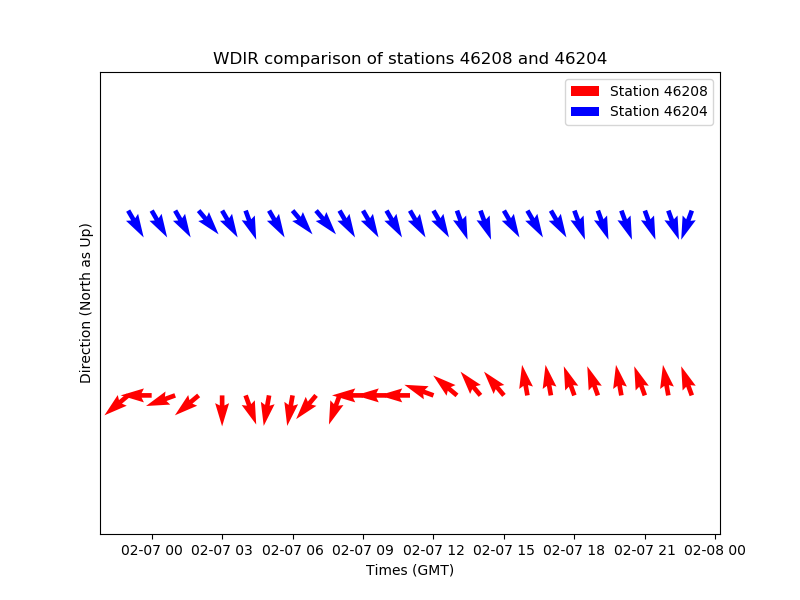
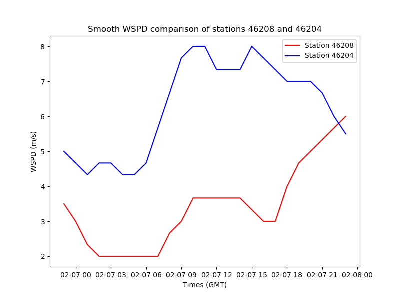

# env_grapher
Visualizes Weather data from Environment and Climate Change Canada probes given their station number and the attribute to graph. 

Visit See https://www.ndbc.noaa.gov/ for map of all active probes, select those that are maintained by Environment and Climate Change Canada.

## Examples:
Example of Wind Direction Graphing off the coast of British Columbia:

Example of Wind Speed Graphing by the same two probes:

